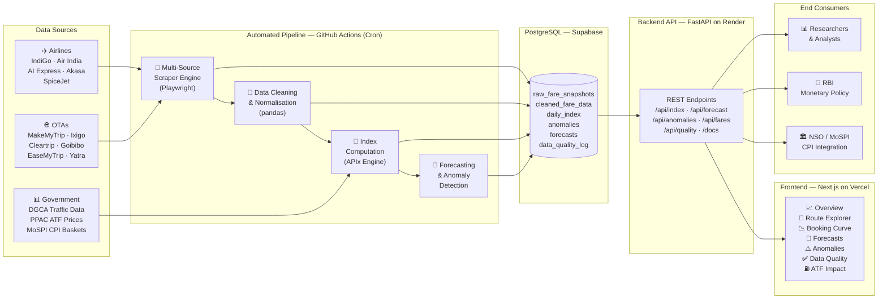
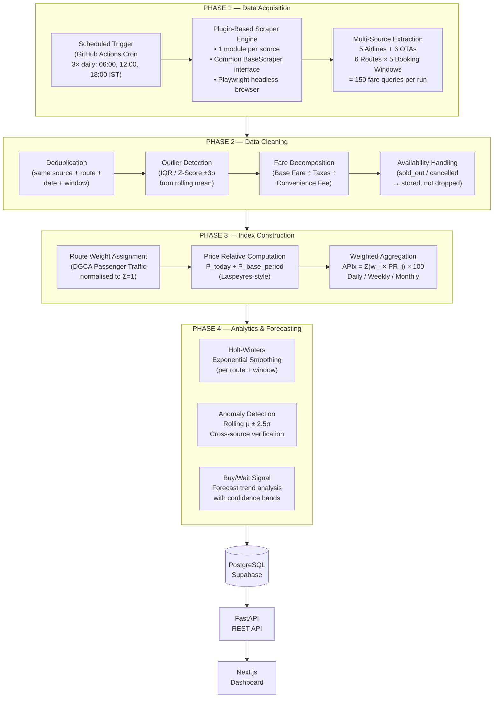
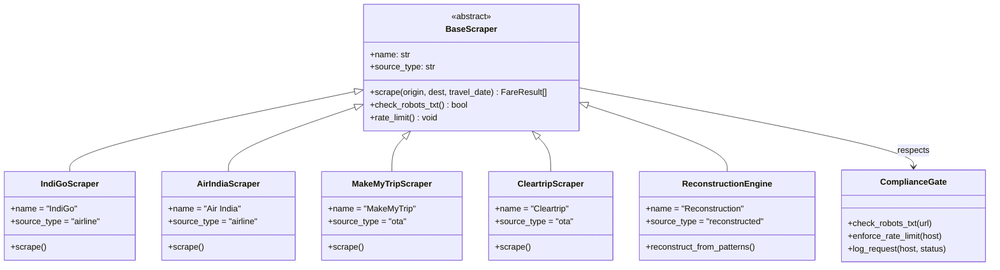
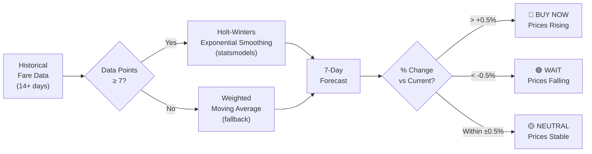
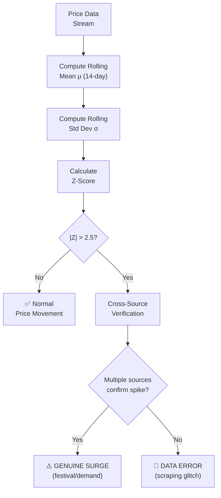
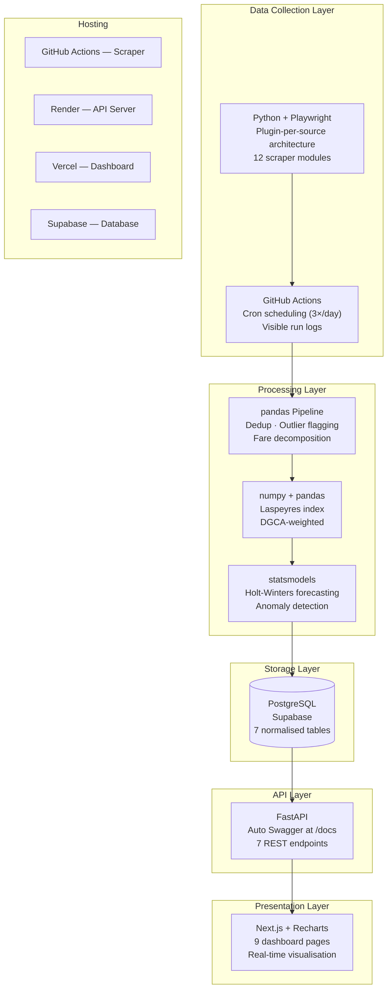
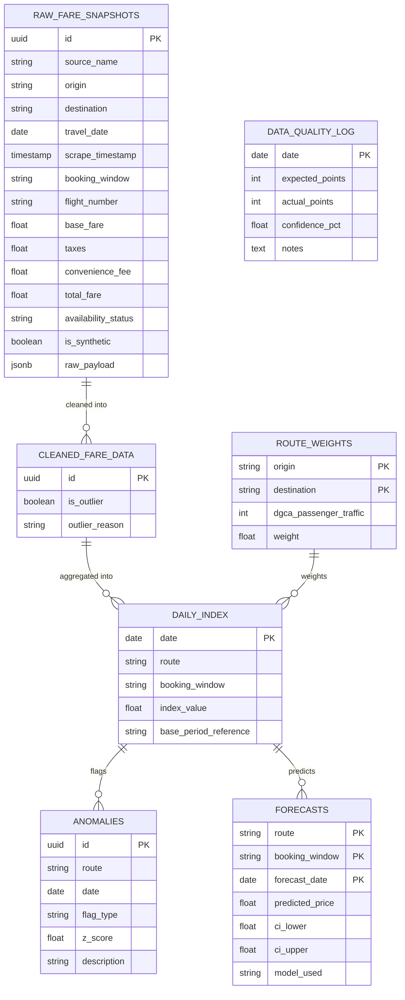
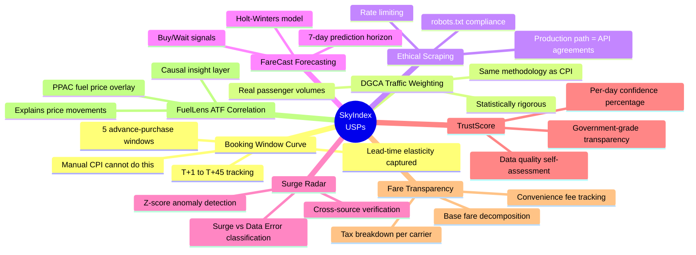
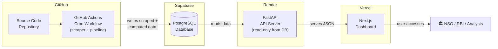

# SkyIndex — Complete Methodology & System Architecture
### Real-time Airfare Price Index (APIx) for CPI Augmentation
**SIH Problem Statement 26056 | MoSPI — Data Informatics & Innovation Division (DIID)**

---

## 1. Problem Definition & Motivation

India's Consumer Price Index (CPI), published by NSO under MoSPI, is the primary inflation measure used by RBI for monetary policy. The **"Transport & Communication"** sub-group currently collects airfare data through **manual price-collection from a limited set of outlets** — a method that fundamentally cannot capture dynamic pricing, where the same route can vary **200–400%** depending on advance-booking window, day-of-week, and demand surges.

> [!IMPORTANT]
> **The core gap:** Manual collection captures a single price at a single point in time. It structurally misses the entire **lead-time elasticity curve** — the pattern of how prices change as the booking date approaches the travel date. This means RBI is setting monetary policy on structurally incomplete inflation data for air travel.

---

## 2. Proposed Solution — SkyIndex Platform

SkyIndex is an end-to-end automated platform that:
1. **Scrapes** live airfares daily from Indian airline websites and OTAs
2. **Cleans & normalises** the collected price quotes
3. **Computes** a Real-time Airfare Price Index (APIx) at daily, weekly, and monthly frequencies
4. **Forecasts** future price trends with explainable statistical models
5. **Exposes** a consumable REST API for NSO/RBI integration
6. **Visualises** everything on an interactive analytical dashboard

---

## 3. End-to-End Architecture



---

## 4. Detailed Data Flow Pipeline



---

## 5. Route Basket & Booking Windows

### 5.1 Representative City-Pairs (DGCA Traffic-Weighted)

| Route | City Pair | DGCA Annual Pax (M) | Normalised Weight |
|-------|-----------|---------------------|-------------------|
| DEL-BOM | Delhi → Mumbai | 10.2M | 0.22 |
| DEL-BLR | Delhi → Bengaluru | 7.8M | 0.17 |
| BOM-BLR | Mumbai → Bengaluru | 5.1M | 0.11 |
| DEL-CCU | Delhi → Kolkata | 5.5M | 0.12 |
| BLR-HYD | Bengaluru → Hyderabad | 4.8M | 0.10 |
| MAA-DEL | Chennai → Delhi | 4.3M | 0.09 |
| DEL-HYD | Delhi → Hyderabad | 4.6M | 0.10 |
| BOM-CCU | Mumbai → Kolkata | 4.0M | 0.09 |

### 5.2 Advance-Purchase Windows

| Window | Meaning | Why It Matters |
|--------|---------|----------------|
| **T+1** | 1 day before travel | Last-minute premium — peak dynamic pricing |
| **T+7** | 7 days before | Short-term booking — moderate premium |
| **T+15** | 15 days before | Standard advance booking |
| **T+30** | 30 days before | Early booking — typically lower fares |
| **T+45** | 45 days before | Maximum advance — baseline price level |

> This 5-window structure captures the **complete lead-time elasticity curve** per route — the single most important innovation over manual CPI collection.

---

## 6. Scraper Architecture (Plugin System)



### Ethical Scraping Safeguards

| Safeguard | Implementation |
|-----------|---------------|
| **robots.txt compliance** | `ComplianceGate` fetches and caches robots.txt per domain; scraper skips disallowed paths |
| **Rate limiting** | Max 60 requests/host/hour; configurable crawl delay (default 5s between requests) |
| **Session management** | Persistent browser contexts with realistic fingerprints to reduce redundant sessions |
| **Transparent fallback** | Sources blocked by CAPTCHA/anti-bot → clearly flagged `is_synthetic = true` in database |
| **Production path** | Documented recommendation: official MoSPI data-sharing API agreements with airlines for production deployment |

---

## 7. Index Construction Methodology (APIx)

### 7.1 Mathematical Foundation

The APIx follows a **modified Laspeyres price-relative index**, the same family of methodology used by CPI itself:

```
APIx(t) = Σᵢ [ wᵢ × (Pᵢ(t) / Pᵢ(0)) ] × 100
```

Where:
- `wᵢ` = DGCA traffic-weighted importance of route `i` (normalised: Σwᵢ = 1)
- `Pᵢ(t)` = cleaned average fare for route `i` on date `t`
- `Pᵢ(0)` = base-period average fare (reference month, e.g., June 2026)
- `100` = base index value

### 7.2 Sub-Indices Computed

| Index Level | Granularity | Use Case |
|-------------|------------|----------|
| **Overall APIx** | Single national number | Direct CPI augmentation |
| **Route-wise APIx** | Per city-pair | Sector-level inflation analysis |
| **Window-wise APIx** | Per booking window (T+1…T+45) | Lead-time elasticity measurement |
| **Route × Window** | Most granular | Full dynamic pricing surface |

### 7.3 Temporal Aggregation

| Frequency | Method | Output |
|-----------|--------|--------|
| **Daily** | Weighted mean of all fares collected that day | Real-time tracking |
| **Weekly** | 7-day rolling average of daily indices | Smoothed trend |
| **Monthly** | Calendar-month average of daily indices | CPI-compatible output for NSO |

---

## 8. Forecasting Module (FareCast)



**Why Holt-Winters over Deep Learning:**
- Explainable to policy-makers (judges can understand the math)
- Works well with limited data (30 days, not years)
- Fast to compute (no GPU required)
- Standard in government statistical agencies worldwide

---

## 9. Anomaly Detection (Surge Radar)



---

## 10. Data Quality & Trust Score

```
TrustScore = (Actual Data Points Collected / Expected Data Points) × 100
```

| Score Range | Label | Meaning |
|-------------|-------|---------|
| 90–100% | 🟢 Excellent | All sources reporting, high confidence |
| 75–89% | 🟡 Good | Minor gaps, index still reliable |
| 50–74% | 🟠 Fair | Some sources down, use with caution |
| < 50% | 🔴 Low | Significant data gaps, flagged for review |

This self-assessment metric is logged in `data_quality_log` and displayed on the dashboard — giving NSO/RBI an honest signal of how much to trust each day's index value.

---

## 11. System Components & Technology Stack



---

## 12. Database Schema (7 Tables)



---

## 13. API Endpoints (NSO/RBI Integration Ready)

| Endpoint | Method | Purpose |
|----------|--------|---------|
| `/api/v1/index/overall` | GET | National-level APIx (daily/weekly/monthly) |
| `/api/v1/index/route/{origin}/{dest}` | GET | Route-specific index with historical series |
| `/api/v1/index/booking-curve/{origin}/{dest}` | GET | Lead-time elasticity curve (T+1 to T+45) |
| `/api/v1/forecast/{origin}/{dest}` | GET | 7-day price forecast with Buy/Wait signal |
| `/api/v1/anomalies` | GET | Flagged surge events with classification |
| `/api/v1/fares/breakdown/{route}` | GET | Base fare vs taxes vs convenience fee transparency |
| `/api/v1/quality/current` | GET | Current TrustScore and data completeness |
| `/api/v1/reference/atf-correlation` | GET | ATF fuel price overlay data |
| `/api/v1/reference/compliance-matrix` | GET | Ethical scraping compliance status |
| `/docs` | GET | Auto-generated Swagger/OpenAPI documentation |

---

## 14. Dashboard Pages (9 Views)

| Page | Key Visualisation | Purpose |
|------|-------------------|---------|
| **Overview (Home)** | APIx trend line + stat cards | National index at a glance |
| **Route Explorer** | Route-specific index with per-route graphs | Drill into any city-pair |
| **Booking Curve** | Lead-time elasticity chart (T+1→T+45) | **Core USP** — dynamic pricing curve |
| **Fare Forecast** | Historical + predicted price with Buy/Wait signal | Consumer & policy value-add |
| **Anomalies** | Flagged events with severity and classification | Surge vs. data error separation |
| **Fare Transparency** | Stacked bar: Base Fare / Taxes / Convenience Fee per carrier | Price decomposition insight |
| **ATF Impact** | Dual-axis: APIx trend vs ATF fuel price correlation | Explains *why* prices move |
| **Data Quality** | TrustScore gauge + source completeness table | Self-assessment transparency |
| **Compliance** | robots.txt adherence + rate-limit audit log | Ethical scraping proof |

---

## 15. Unique Selling Propositions (USPs)



---

## 16. Validation Strategy

### 16.1 Backtesting Against DGCA Data
- Aggregate our daily index to monthly averages per route
- Compare trend direction and magnitude against DGCA's published monthly average-fare statistics
- Correlation coefficient target: **r > 0.85** to demonstrate system reliability

### 16.2 Pipeline Correctness Tests
- Unit tests for outlier detection (synthetic extreme values correctly flagged)
- Unit tests for fare decomposition (known base+tax examples parsed correctly)
- Integration test: full pipeline from raw scrape → cleaned data → index output

### 16.3 Self-Validation via TrustScore
- Daily automated confidence assessment
- Historical TrustScore trend visible on dashboard
- Honest reporting — a 92% confidence day is more credible than claiming 100%

---

## 17. Deployment Architecture



> [!IMPORTANT]
> **Key architectural decision:** The scraper pipeline and the API server are **completely separated**. The scraper runs on GitHub Actions (heavy, scheduled, writes to DB). The API runs on Render (lightweight, always-on, reads from DB). This prevents headless-browser scraping from blocking or crashing the API server.

---

## 18. Scalability & Future Roadmap

| Phase | Scope | Timeline |
|-------|-------|----------|
| **Current (Prototype)** | 8 routes, 5 windows, 2-3 live sources + reconstruction | SIH 2026 |
| **Phase 2** | All domestic routes with DGCA traffic > 1M pax/year | Post-shortlist |
| **Phase 3** | Official API agreements with airlines (replacing scraping) | Production |
| **Phase 4** | International routes, real-time streaming, ML-based forecasting | Long-term |

### Production Deployment Path
At production scale for MoSPI/NSO, the system transitions from web scraping to **official data-sharing API agreements** with airlines and OTAs — which is realistically how a government statistical system would operate. The scraping prototype demonstrates the concept; the API architecture is already built to seamlessly swap in official data feeds without changing the downstream pipeline.

---

## 19. Impact Statement

| Stakeholder | Current State | With SkyIndex |
|-------------|--------------|---------------|
| **NSO/MoSPI** | Manual, infrequent fare collection | Automated daily index with 5-window granularity |
| **RBI** | Stale transport-inflation data for CPI | Real-time airfare inflation signal for monetary policy |
| **DGCA** | Monthly averages only | Daily route-level analytics with anomaly flagging |
| **Researchers** | No public dynamic-pricing dataset | Open API with historical data access |
| **Consumers** | No price-trend visibility | Buy/Wait signals based on forecast trends |
